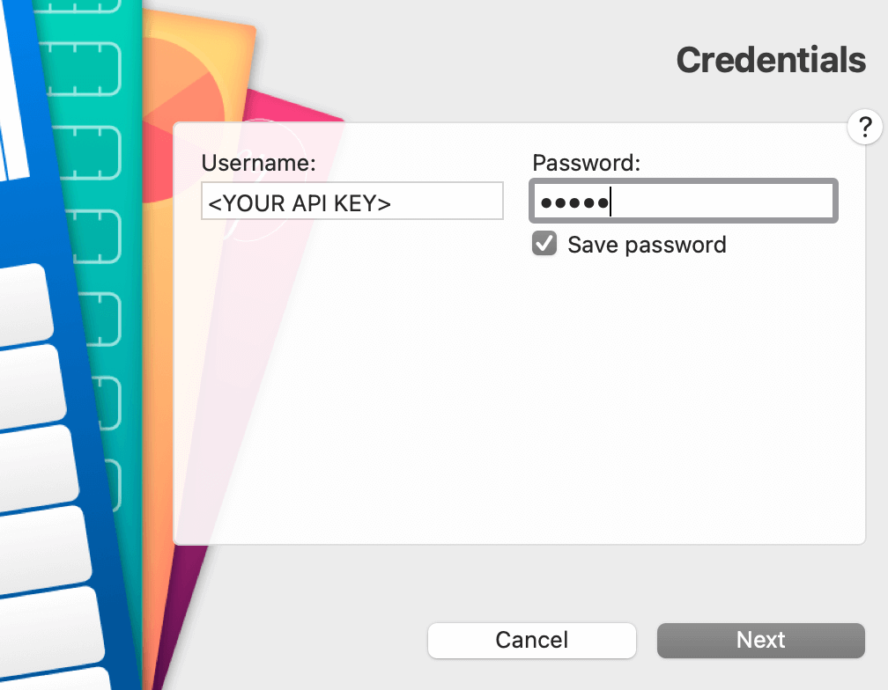

MoneyMoney Splitwise extension
================================
Inofficial MoneyMoney extension for [Splitwise](https://www.splitwise.com).

This extension will only list the balances with your friends and won't show every transaction.

Instructions
-----
1. Sign in with your Splitwise Account on [Splitwise's website](https://www.splitwise.com).
2. Go to the [Oauth Client section](https://secure.splitwise.com/oauth_clients).
3. Create a new app ("Register your application" button).
4. Copy the the MoneyMoney extension Lua file `Splitwise.lua` to the extensions directory (`~/Library/Containers/com.moneymoney-app.retail/Data/Library/Application Support/MoneyMoney`) and restart MoneyMoney.
5. Create a new account, select "Splitwise" as account type.
6. Enter `dummy` as username and use your freshly generated API key (result of step 3) as password.

